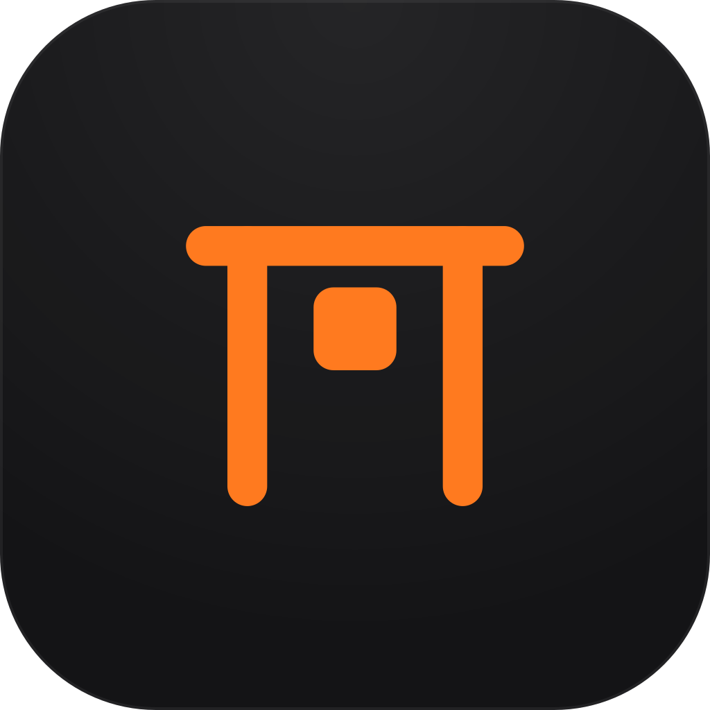

<div align="center">



# Gantry

**The AI workspace that stays on your machine.**

A chat client, a coding agent and connectors to the tools you already use, in one desktop app.
Bring your own API keys. Nothing leaves your computer except the requests you choose to make.

[](LICENSING.md)
[](#install)
[](#how-its-built)

[oljo.dev](https://oljo.dev) · [Connectors](https://oljo.dev/connectors/) · [Architecture plan](docs/plan/README.md) · [Build it](docs/dev/setup.md)

</div>

<!-- SCREENSHOT: a real window, Chat surface, dark, mid-answer with an activity row open. -->

---

## What it is

Three things that are usually three applications, in one window, with one permission model and
one local database behind them.

- **A chat client for any model.** Anthropic, OpenAI, Google, xAI, OpenRouter, or any
  OpenAI-compatible endpoint you point it at. Your keys, your account with the provider, no
  middleman.
- **A coding agent that works in your folders.** Attach a directory; the agent reads it, edits
  files as diffs you can revert one by one, runs commands and shows you every one of them.
- **Connectors to everything else.** Sixty-one third-party MCP servers in the catalogue —
  GitHub, Linear, Notion, Sentry, Figma, Supabase, Stripe, Playwright and more — plus six built
  into the app. Nothing installs itself.

## What it is not

No account. No server of ours. No telemetry, no analytics, no crash reporting, no "anonymous
usage data". There is nowhere for your conversations to go: they are rows in a SQLite file in
your own application data directory. If you delete the app, you have deleted the product.

## Principles

**Local by construction.** The app talks to the providers and services you configure, and to
nothing else. There is no Gantry backend to talk to.

**Bring your own keys.** You pay the provider directly, at the provider's price, and you can see
exactly what each turn cost in tokens.

**Nothing happens off screen.** Every tool call is a row in the turn's activity feed with its
arguments, its result and how long it took. The whole output is kept, not a preview of it.

**It asks first, on your terms.** Which calls run without a question is the mode you chose for
that chat — from one that asks about every single call to one that runs a whole task hands-off
with a guard model watching it. Under all four is a floor that always asks.

## What you can do with it

### Talk to any model

One chat can move between providers mid-conversation; the transcript is provider-neutral and is
re-projected for whoever answers next. Streaming text and reasoning, stop at any time, retry a
turn, rate it, search every message you have ever sent, export a chat as Markdown or JSON. Model
prices, context windows and capabilities come from each provider's own catalogue, so the picker
knows which models can search the web or think before answering. One switch turns on the web:
the provider's own search where the model has it, and either way a built-in connector that
searches, opens a page, pages through a long one and finds a pattern in it. A private window
(`Ctrl/Cmd+Shift+N`) leaves nothing behind at all.

### Work in your folders

The **Code** surface is the same app with different defaults: a folder before the first message,
file and shell tools on, and a Changes pane that lists every file the session touched with its
diff and a **Revert** beside it. Edits go through a journal, so undo is exact rather than
optimistic. Commands stream their output line by line and the whole log is kept.

### Decide how much to trust it

Four modes, per chat, changed at any time from the composer:

| Mode | What runs without asking |
|------|--------------------------|
| **Manual** | Nothing. Every call is a card you answer, reads included — each one offering to stand for this chat. |
| **Auto-edit** | Anything Gantry can undo locally: edits inside your attached folders. Commands, and anything that changes something elsewhere, still ask. |
| **Plan** | Nothing that changes anything — the tools are not even offered. The model researches, writes a plan, and offers to execute it. |
| **Auto** | Everything, with a **guard** model reading each risky call first and blocking what it should not do. Turning the guard off is its own deliberate step. |

Under all four is a guardrail floor you can edit — hard denials, always-confirm actions,
sensitive paths, secret patterns — that no mode and no grant can talk its way past. Permissions
you grant are scoped to the argument (this folder, this command) and to this chat, and you can
see and revoke them.

### Connect the tools you use

Sixty-seven connectors ship in the catalogue: **six built into the app** — files, editor, shell,
web, media generation and sub agents — **nine that run locally** on Node, Python or Docker, and
**fifty-two remote MCP servers** reached over HTTPS. Forty-one sign in with OAuth, nine take an
API key, and eleven need no account at all. Each entry says what the server can see of yours
before you install it, and every tool it exposes is tiered and subject to the same permission
model as everything else. A model that needs a connector you do not have can suggest one;
installing it is still your click.

### Get artifacts, not walls of text

Documents, code, SVG, HTML pages, Mermaid diagrams and React components appear in a panel beside
the conversation, versioned, zoomable and exportable. The three executable kinds run in an
opaque-origin sandbox with no network, no file access and no route back into the app. Thirty-four
hostile artifacts — reaching for the app's IPC, fetching a remote script, navigating the window,
reading storage, hanging the frame — are mounted in a real browser engine by the test suite and
required to fail at every one of them.

### Teach it once

**Skills** are plain `SKILL.md` playbooks (the Agent Skills format) that load themselves when
they are relevant. **Memory** is a visible table of short facts it has learned about you, each
one proposed, confirmable, editable and deletable. **Projects** group chats with shared
instructions, knowledge files and defaults. **Sub agents** let one turn hand work to focused
helpers and show you the tree of what they did.

### Make pictures, voice and video

The media connector calls image, speech and video models as one step of the model's own work,
from the same keys, and the result renders in the answer where it was made.

## Your keys and your data

One random master key lives in your operating system's credential store — Keychain, Credential
Manager, or Secret Service — and every API key and OAuth token is encrypted with it
(XChaCha20-Poly1305) and stored in the local database. The interface never receives a secret in
the clear; secrets do not cross the IPC boundary at all. On a Linux box with no keyring, the app
says so rather than pretending, and falls back to a file only your user can read.

Everything else — chats, messages, tool calls, artifacts, skills, memories, settings — is one
SQLite database plus a content-addressed blob directory in your application data folder, listed
for you under **Settings → Data & privacy**, where you can also back it up, compact it, sweep
unreferenced files or open the folder.

More in [SECURITY.md](SECURITY.md).

## Install

> **v0.1.0 has not shipped yet.** When it does, installers appear on the
> [releases page](https://github.com/oljodev/gantry/releases) and behind the download buttons on
> [oljo.dev](https://oljo.dev/download/).

| Platform | Ships as | State |
|----------|----------|-------|
| **Linux** | AppImage, `.deb`, `.rpm` | Developed and tested on |
| **Windows** | NSIS installer, x64 | Builds and type-checks in CI; hardware testing checklist in [`docs/dev/setup.md`](docs/dev/setup.md) |
| **macOS** | — | The code supports it; signed builds are not shipped for v0.1.0. Builds from source. |

You will need a key from at least one provider. [OpenRouter](https://openrouter.ai) is the
quickest start — one key reaches most models — and the first-run screen walks you through it.

## Build from source

Rust 1.93, Node 22, pnpm 10, and your platform's Tauri prerequisites
([`docs/dev/setup.md`](docs/dev/setup.md) has the package lists).

```sh
git clone https://github.com/oljodev/gantry.git
cd gantry
pnpm install && pnpm fonts     # dependencies, and the bundled fonts
pnpm tauri dev                 # the app, with hot reload
```

Everything runs from the repository root:

| Command | What |
|---------|------|
| `pnpm tauri build` | an installable bundle in `target/release/bundle/` |
| `pnpm dev` | the frontend alone in a browser, with the backend calls skipped |
| `cargo test --workspace` | the Rust tests, including the IPC bindings drift check |
| `pnpm typecheck && pnpm lint && pnpm test` | the frontend checks |
| `cargo xtask check-windows` | type-check the Windows build from Linux or macOS |
| `cargo xtask validate-connectors` | check every manifest against the schema and the website's list |

## Keyboard

| | |
|---|---|
| `Ctrl/Cmd+K` | the command palette: chats, messages, settings, projects, connectors |
| `Ctrl/Cmd+N` | new chat · `+Shift` for a private one |
| `Ctrl/Cmd+Shift+K` | switch between the Chat and Code surfaces |
| `Ctrl/Cmd+B` | show or hide the sidebar |
| `Ctrl/Cmd+,` | settings |
| `Shift+Tab` | cycle the permission mode |

## How it's built

A Tauri 2 application: a Rust backend that owns every decision, and a React 19 frontend that
renders what it is told. The IPC contract is generated from the Rust commands by `tauri-specta`,
and a test fails the build if the generated TypeScript drifts from them.

```
desktop/
  app/          the Tauri crate — the only code that knows Tauri exists
  crates/       the engine: core types, store, secrets, providers, agent, connectors, workspace
  connectors/   one folder per connector: manifest, icon, README; native ones are Cargo crates
  frontend/     the React app (Vite, Tailwind 4, Base UI, TanStack Router/Query, Zustand)
  assets/       prompts, guardrails, model overrides, branding
web/            the two static sites: oljo.dev and id.oljo.dev
docs/plan/      the architecture plan this was built against
```

The plan came first and is still the reference: eighteen documents covering the provider layer,
the connector system, permissions, streaming, the data model, artifacts, skills and memory, the
design system and the two surfaces. When the code contradicts a document, the document is
corrected in the same commit — so [`docs/plan/`](docs/plan/README.md) describes what exists, not
what was once intended.

Speed is measured in the running app rather than in a benchmark: **Settings → Advanced → Speed**
shows how long the window took to open, how long each dialog took to appear and what every
command cost ([`docs/dev/performance.md`](docs/dev/performance.md)).

## Status

Pre-release, and honest about it. The MVP is built — providers, persistence, the tool loop, all
four permission modes, the Code surface, artifacts, connectors and the install flow, projects,
skills, memory, sub agents — and what remains before v0.1.0 is packaging, signing and a release
pass. [`docs/plan/09-roadmap.md`](docs/plan/09-roadmap.md) tracks it milestone by milestone, with
what was deviated from and why.

## Where things are written down

| | |
|---|---|
| [`docs/plan/`](docs/plan/README.md) | the architecture plan, eighteen documents and a decision register |
| [`docs/dev/setup.md`](docs/dev/setup.md) | prerequisites per OS, everyday commands, the Windows checklist |
| [`docs/connectors/`](docs/connectors/) | the built-in connectors — files, editor, shell, web — tool by tool |
| [`SECURITY.md`](SECURITY.md) | how keys, permissions and the sandbox work, and how to report a problem |
| [`LICENSING.md`](LICENSING.md) | the licence in plain language |

## Contributing

Issues and discussions are the channels. [`CONTRIBUTING.md`](CONTRIBUTING.md) has the house rules:
small coherent commits, the design tokens are the only place colours and sizes live, and a change
that contradicts the plan updates the plan in the same commit.

## Licence

Functional Source License 1.1 with the Apache 2.0 future licence (`FSL-1.1-ALv2`). Use it for
anything, read and modify the source, fork it and share it; the one thing you may not do is sell
it as a competing product or service. **Every release becomes Apache 2.0 two years after it
ships.** Plain-language summary in [`LICENSING.md`](LICENSING.md), legal text in
[`LICENSE`](LICENSE).

© Olav Jodal
